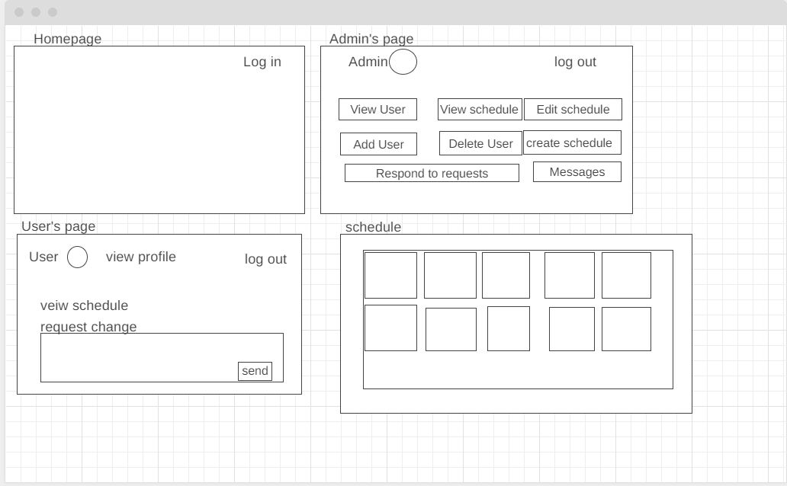
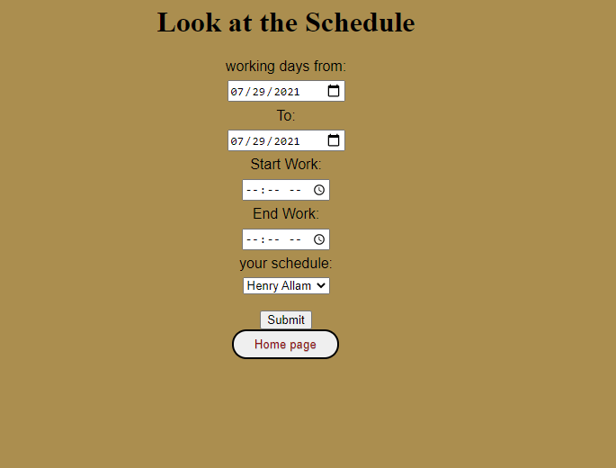

Schedule-maker

## Objective:
-create a responsive website using HTML, CSS, Node.js, Mongoose, MongoDB

## Motivation
Previous experience working at a retail store/company, wanted to know my schedule and wish that we had a way to view our schedule at home or from anywhere, so i decided to make one that's accesible anywhere.

## To play the game:
Click here (https://schedulemakerproject2.herokuapp.com/)./

## initial Wire frame:

## how it looks now:

## Technology used:
HTML
CSS
Node.js
Mongoose
MongoDB
Heroku

## Minimum Viable Product(MVP)
1- As a user i can login with Google Oauth.
2- As a user i should be able to see my name and avatar on screen after login in.
3- As a user i should be able to redirect toa adding a new user's page.
4- As a user i should be able to add a new user with name and email.
5- As a user i can edit that new user to make adjustments.
6- As a user i cn update new user info.
7- As a user i can delete a new user.
8- As a user i create a schedule to user.
9- As a user i can edit, update and delete schedule.

## stretch goals 
1- Add an admin property so not everyone can view other users info.
2- have a accurate user schedule when it's visible when they log in.
3- fixing Css. 
4- Adding a message box wherer the user can requeest from admin edits for his schedule
